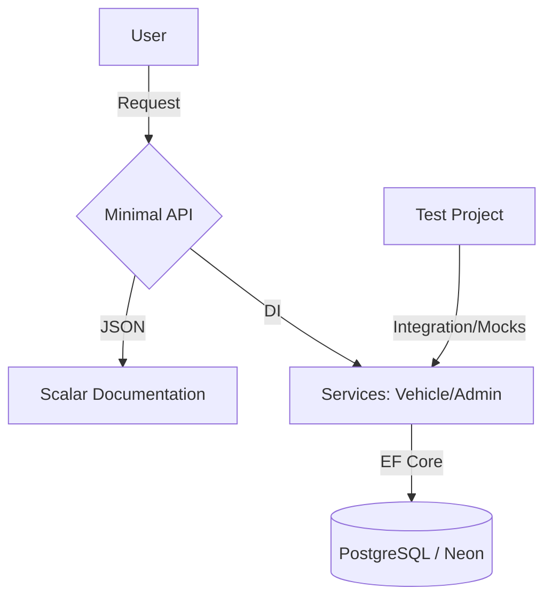

# 🚀 Minimal API - Gestão de Veículos

> API REST desenvolvida com .NET 10 (LTS) e C# 14, utilizando Minimal APIs e foco em boas práticas de arquitetura, segurança e testes.


Este projeto implementa uma **Minimal API** robusta para gestão de frotas, com foco em segurança (JWT/RBAC), arquitetura limpa e persistência em nuvem. Foi evoluído a partir de uma base de formação para incluir as tecnologias mais recentes do ecossistema Microsoft.

---

## 📌 Objetivo do Projeto

Projeto desenvolvido para demonstrar boas práticas no desenvolvimento de APIs com .NET, incluindo autenticação JWT, arquitetura em camadas, testes e persistência em banco de dados PostgreSQL.:
- **Arquitetura em Camadas:** Separação clara de responsabilidades.
- **Segurança Avançada:** Autenticação JWT e controle de permissões (RBAC).
- **Qualidade de Software:** Testes de integração com isolamento por Mocks.
- **Infraestrutura Cloud:** Integração com banco de dados PostgreSQL (Neon).

---

## 🛠️ Tecnologias Utilizadas

* **Framework:** .NET 10 (LTS)
* **Linguagem:** C# 14
* **Banco de Dados:** PostgreSQL (Neon Cloud)
* **Autenticação:** JWT Bearer + Role-Based Access Control (RBAC)
* **Documentação:** Microsoft.AspNetCore.OpenApi + Scalar API Reference
* **Testes:** MSTest (Testes de Integração e Mocks)

---

## 📐 Arquitetura da Solução

O projeto segue uma estrutura de **Solution-Based Architecture**:


---
## 🧪 Qualidade e Testes

A confiabilidade é um dos pilares do projeto. A suíte de testes cobre:

- Fluxo completo de autenticação (login e autorização por perfil)
- CRUD completo da entidade Veículo
- Validação de permissões (ADM / Editor)
- Isolamento de dependências com mocks
- Controle de concorrência na execução dos testes

Objetivo: garantir comportamento consistente da API e prevenir regressões.

---
## 🔐 Funcionalidades Implementadas

### 👤 Administradores
- Cadastro
- Login com geração de JWT
- Controle de perfil (ADM / Editor)

### 🚗 Veículos
- Cadastro
- Listagem
- Busca por ID
- Atualização
- Remoção

### 🛡 Segurança
- Autenticação via JWT
- Autorização baseada em perfil (RBAC)
- Isolamento de credenciais com .NET User Secrets
- Connection string protegida (não exposta no repositório)

---
## ▶️ Como Executar o Projeto Localmente

### 1️⃣ Clonar o repositório

```bash
git clone https://github.com/Cassisilverston/minimal-api
cd minimal-api
```

### 2️⃣ Configurar a Connection String
Utilize .NET User Secrets:
```bash
dotnet user-secrets set "ConnectionStrings:DefaultConnection" "SUA_CONNECTION_STRING"
```

### 3️⃣ Aplicar as migrations
```bash
dotnet ef database update
```
### 4️⃣ Executar a aplicação
```bash
dotnet run
```

Acesse:
```bash
https://localhost:{porta}/scalar
```

---

## 🌍 Banco de Dados

- O projeto utiliza **PostgreSQL hospedado na Neon (cloud)**.
- A configuração foi estruturada para funcionar tanto em ambiente local quanto em produção por meio de variáveis de ambiente.

---

## 📚 Principais Aprendizados

- Estruturação de APIs com Minimal API
- Implementação de autenticação JWT
- Configuração de EF Core com PostgreSQL
- Separação de responsabilidades em camadas
- Escrita de testes de integração
- Uso de variáveis de ambiente e User Secrets
- Integração com banco em nuvem
- Preparação para deploy em ambiente cloud

---

## 🔄 Próximas Evoluções

- Containerização com Docker
- Pipeline de CI/CD
- Deploy automatizado
- Monitoramento e logging estruturado


